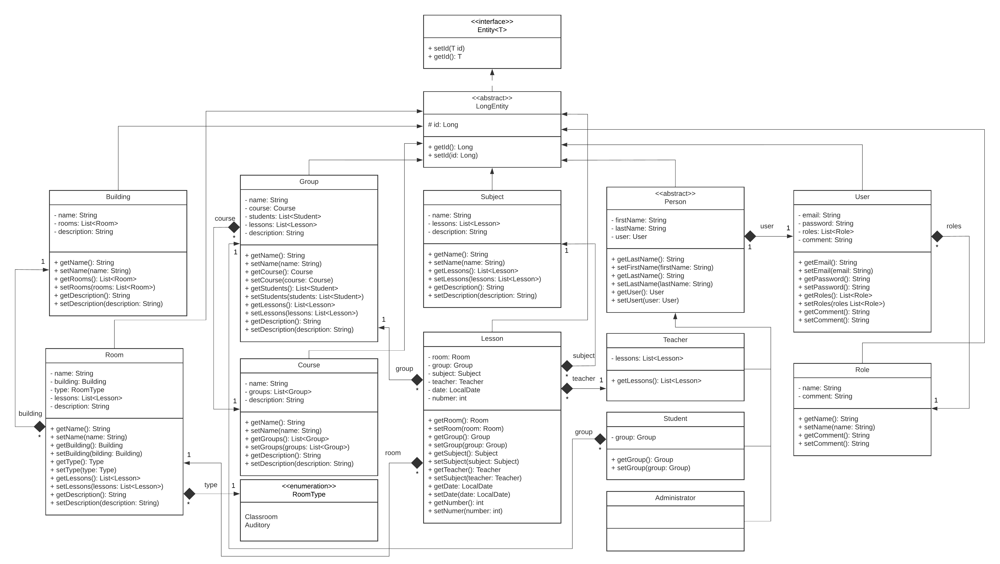

<!-- PROJECT LOGO -->
<!--suppress HtmlUnknownAnchorTarget, HtmlDeprecatedAttribute -->
 

  

<h3 align="center">University CMS</h3>
  

    An awesome University CMS!
  

<!-- ABOUT THE PROJECT -->
### About The Project
***
This is my pet project :)
The following framework and libraries are used:
- Spring boot
- Spring MVC
- Spring data
- Spring security
- Thymeleaf
- Webjars
- Flyway
- Lombok

App by default use PostgreSQL and can be deployed in docker.

<!-- Summary -->
### Summary
***

The main feature of the application is Class Lesson for students and teachers. 
Students or teachers can get their timetable for a day or for a month.
The following persons work with the system:
- Administrator
- Teacher
- Student

<!-- ADMINISTRATOR USAGE -->
### Administrator usage
***

The administrator can create, change, or delete any row on any table.  

**Default credential**  
username: administrator@university.local  
password: root

<!-- TEACHER USAGE -->
### Teacher usage
***
Teacher can view only own lessons.

<!-- STUDENT USAGE -->
### Student usage
***
Student can can view only own lessons.

<!-- UML DIAGRAM -->
### UML class diagram
***

  

(<a href="#readme-top">back to top</a>)
